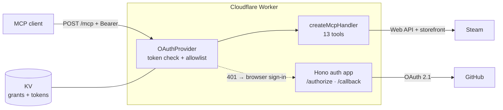

<div align="center">

# steam-mcp

**Your Steam account as a remote MCP server** — library, achievements, lifetime stats,
news, friends and wishlist, available to any MCP client.

[](https://workers.cloudflare.com/)
[](https://www.typescriptlang.org/)
[](https://modelcontextprotocol.io/)
[](LICENSE)

Stateless Streamable HTTP · OAuth 2.1 with GitHub sign-in · login allowlist · no Durable Objects

</div>

---

## What you can ask

Once connected, these are ordinary questions to your client:

> *"How many games do I own, and how many have I never opened?"*
>
> *"What's my achievement completion across my ten most-played games?"*
>
> *"Anything on my wishlist discounted right now?"*
>
> *"How many people are playing CS2 at this moment — and what are my lifetime stats in it?"*

Every tool answers with compact JSON and says when it truncated:

```jsonc
{
  "total_games": 160,
  "played_games": 78,
  "never_played": 82,
  "total_playtime": "2044.3h",
  "median_playtime_of_played": "6.8h",
  "top_games": [{ "name": "Counter-Strike 2", "playtime": "612.5h" }]
}
```

## Tools

Thirteen, grouped by what they touch.

| Tool | What it returns |
|---|---|
| `list_library` | Owned games with playtime; sort by playtime / recency / name. `max_hours: 0` gives the backlog |
| `library_stats` | Game count, total and median hours, backlog size, top 10 |
| `recently_played` | Last two weeks of activity |
| `find_game` | Name → appid, library first, then the store |
| `game_details` | Description, release date, developer, genres, Steam review score, Metacritic, price |
| `get_news` | News and patch notes |
| `player_count` | Concurrent players right now |
| `get_achievements` | Per-game progress, global rarity, and which achievements Steam is hiding |
| `achievement_progress` | Completion across the most-played games (max 15 per call) |
| `game_stats` | Lifetime counters for one game — kills, wins, time, per-map and per-weapon totals. CS2 reports 184 |
| `profile_status` | Online state, current game, Steam level, ban flags |
| `friends` | Friends with online status and current game |
| `wishlist` | Wishlist with prices and discounts |

Any tool taking a `game` accepts either an appid or a name — `"mw4"` resolves through the
library. Passing an appid skips the lookup, so the reply may carry `"game": null` where a
name was not available; `get_achievements` still names the game, because Steam includes the
title in its own response.

## How it works



The MCP layer is the official SDK plus Cloudflare's stateless `createMcpHandler`; Hono owns
the web layer and nothing else. No request keeps state between calls.

## Setup

<details>
<summary><b>1 · Prerequisites</b></summary>

- Node 20+
- A Cloudflare account — the free plan is enough
- `npm install`, then `npx wrangler login`

</details>

<details>
<summary><b>2 · Steam credentials</b></summary>

- API key: <https://steamcommunity.com/dev/apikey> (requires a phone-verified account)
- SteamID64: <https://steamid.io>

> [!IMPORTANT]
> The profile **and** its *Game details* section must be Public. Otherwise the API returns
> an empty library with HTTP 200 and no error of any kind.

</details>

<details>
<summary><b>3 · KV namespace</b></summary>

The OAuth provider stores grants and tokens in KV.

```bash
npx wrangler kv namespace create "OAUTH_KV"
```

Put the returned id into `wrangler.jsonc` under `kv_namespaces[0].id`.

</details>

<details>
<summary><b>4 · GitHub OAuth apps</b></summary>

Create two at <https://github.com/settings/developers> — one local, one production. An OAuth
app holds exactly one callback URL, so a single app cannot serve both.

| | Homepage URL | Callback URL |
|---|---|---|
| local | `http://localhost:8788` | `http://localhost:8788/callback` |
| prod | `https://steam-mcp.<subdomain>.workers.dev` | `https://steam-mcp.<subdomain>.workers.dev/callback` |

> [!WARNING]
> Set `ALLOWED_GITHUB_LOGINS` in `wrangler.jsonc` to your GitHub login (comma-separated for
> more than one). Empty or unset denies **everyone**: sign-in is refused and `/mcp` answers
> 403. That is deliberate — a misconfigured allowlist should lock you out rather than open
> your Steam account to the internet.

</details>

<details>
<summary><b>5 · Secrets</b></summary>

Local development reads `.dev.vars` (copy `.dev.vars.example`). Production uses Wrangler
secrets — nothing sensitive ever enters the repo.

```bash
npx wrangler secret put GITHUB_CLIENT_ID
npx wrangler secret put GITHUB_CLIENT_SECRET
npx wrangler secret put AUTH_STATE_SECRET   # openssl rand -hex 32
npx wrangler secret put STEAM_API_KEY
npx wrangler secret put STEAM_ID
```

`AUTH_STATE_SECRET` signs the pending authorization request that travels through the GitHub
redirect, so the flow needs no cookie.

</details>

<details>
<summary><b>6 · Run locally</b></summary>

```bash
npm run dev          # http://localhost:8788/mcp
npm run inspector    # MCP Inspector, second terminal
```

In the Inspector: enter `http://localhost:8788/mcp`, open **OAuth Settings → Quick OAuth
Flow**, sign in with GitHub, then **Connect → List Tools**.

</details>

<details>
<summary><b>7 · Deploy</b></summary>

```bash
npm run typecheck
npm run build:check   # bundle size; the limit is 64 MiB uncompressed
npm run deploy
```

The endpoint is `https://steam-mcp.<subdomain>.workers.dev/mcp`.

</details>

<details>
<summary><b>8 · Connect a client</b></summary>

Claude (web, desktop, mobile): **Settings → Connectors → Add custom connector**, paste the
`/mcp` URL. Sign-in happens in the browser.

Clients without remote-MCP support:

```json
{
  "mcpServers": {
    "steam": {
      "command": "npx",
      "args": ["-y", "mcp-remote", "https://steam-mcp.<subdomain>.workers.dev/mcp"]
    }
  }
}
```

</details>

## Free-plan budget

The free plan is not a limitation to work around here — it is a design constraint the code
already respects.

| Limit | Free plan | How it's handled |
|---|---|---|
| CPU per request | 10 ms | Compact JSON only, no pretty-printing, no per-item loops over the full library |
| External subrequests | 50 | `achievement_progress` caps fan-out at 15 games; `wishlist` costs 2 regardless of size |
| Simultaneous connections | 6 | Fan-out runs in batches of 5 |
| Bundle size | 64 MiB uncompressed | Currently ~3.3 MiB (629 KiB gzip) |

CPU time excludes waiting on `fetch()`, so slow Steam responses cost nothing.

## Gotchas

- **Undocumented endpoints.** `game_details` and the store path of `find_game` hit
  `store.steampowered.com`, which Valve does not officially support and can change without
  notice.
- **`wishlist` was rebuilt in 2026** after Valve retired `wishlistdata`. It now reads
  `IWishlistService/GetWishlist`, then resolves names and prices with a single batched
  `IStoreBrowseService/GetItems` call. Do not point it back — that path serves HTML now.
- **Nothing in-game is reachable.** No save files, no story progress. Steam exposes only
  what a game itself reports as achievements and stats, and coverage is the developer's
  choice: some games publish 184 counters, many publish none.
- **Prices come back in UAH.** Change `CC` in `src/tools/format.ts` for another region.
- **Dates are UTC.** An evening session east of UTC can read as the following day.

## Project layout

```
src/
├── index.ts        # OAuthProvider wiring, protected /mcp entrypoint
├── auth/           # GitHub OAuth — a Hono app
│   ├── app.ts      #   routes: /authorize, consent POST, /callback, landing
│   ├── state.ts    #   HMAC-signed state envelope, 10-minute TTL
│   ├── github.ts   #   code exchange and profile read
│   ├── ui.ts       #   consent and error pages
│   └── allowlist.ts
├── tools/          # The 13 MCP tools, by domain
│   ├── index.ts    #   registerTools(): builds the context, calls the five below
│   ├── context.ts  #   per-request library memo and name resolver
│   ├── format.ts   #   CC (price region) and news markup stripping
│   ├── library.ts  #   list_library, library_stats, recently_played, find_game
│   ├── achievements.ts  #   get_achievements, achievement_progress, game_stats
│   ├── store.ts    #   game_details, get_news, player_count
│   ├── wishlist.ts
│   └── social.ts   #   profile_status, friends
├── steam.ts        # Steam Web API client, batching, formatting
└── types.ts        # Env bindings and authenticated user props
test/               # vitest suite, runs in workerd
```

Add a tool to the module for its domain and it registers automatically through
`src/tools/index.ts`. Keep an eye on the subrequest budget: one upstream call per game adds
up fast.

`createContext()` must stay a per-request call, made inside the `createMcpHandler` factory.
It holds the library memo, and a Workers isolate serves many requests — hoisting it to
module scope would pin one library fetch and serve it forever as fresh data.

## Tests

```bash
npm test          # vitest, in the Workers runtime
npm run typecheck
```

They run in workerd rather than Node because `@cloudflare/workers-oauth-provider` imports
`cloudflare:workers`, which no Node loader resolves. They also pin the security invariants —
the consent gate must fail closed, a malformed `state` must answer 400 and never 500 — so a
red test there is a real regression, not a fixture to update.

## Releases

`CHANGELOG.md` is written by hand and is the source of truth. Pushing a `v*` tag runs
[`release.yml`](.github/workflows/release.yml), which lifts that version's section out of
the changelog and publishes it as a GitHub Release.

```bash
git tag v0.5.1 && git push origin v0.5.1
```

The tag must point at a commit whose `CHANGELOG.md` already carries the matching
`## [x.y.z]` heading, otherwise the job fails instead of publishing an empty release.
Version numbers live in three places: `package.json`, `CHANGELOG.md`, and the `McpServer`
constructor in `src/index.ts`.

## License

[MIT](LICENSE) © Ilya
